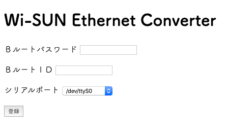

# Wi-SUN Gateway for Home Assistant

## 概要

Ｂルート接続されたスマートメータとの Wi-SUN 通信を、 Ethernet または WiFi 通信に変換するものです。

このリポジトリのバージョンは、Home Assistant のカスタムコンポーネント [echonetlite_homeassistant](https://github.com/scottyphillips/echonetlite_homeassistant) で動作するように調整が加えられています。

## 変更点

- 本プロダクトは、katsumin 氏の[python-echonet-lite](https://github.com/katsumin/python-echonet-lite)から派生しています。
- 変更点は以下の通りです。
    USBに変更されています
    cacheを全部抜いています。直接UDPからTTYに変更しています。
    一つclientしかサポートしていません。


## インストール

- Raspberry Pi OS Lite (32bit) 動作確認は Raspberry Pi Zero WH 上で実行
    - 動作確認時のバージョン -> [September 22nd 2022](https://downloads.raspberrypi.org/raspios_lite_armhf/images/raspios_lite_armhf-2022-09-26/2022-09-22-raspios-bullseye-armhf-lite.img.xz)
    - SDカードの Boot パーティションの設定
        - ssh の有効化
            - ファイル名 `ssh` で空ファイルを作成
        - WiFi 設定
            - ファイル名 `wpa_supplicant.conf` を作成
                ```
                ctrl_interface=DIR=/var/run/wpa_supplicant GROUP=netdev
                update_config=1
                country=JP

                network={
                 ssid="あなたのSSID"
                 psk="あなたのパスワード"
                }
                ```
        - pi ユーザーの作成
            - パスワードハッシュの作成
                - 手持ちの Linux シェルで以下を実行 (-6 は -5, -1, なし も可)
                    ```
                    openssl passwd -6 設定するパスワード
                    ```
            - ファイル名 `userconf` を作成
                ```
                pi:作成したパスワードハッシュ
                ```

-   環境設定 (ネットワーク越しにSSHログインできる)
    ```
    pi@raspberrypi:~ $ sudo raspi-config
    ```
    - 3 Interface Options (SPI, ハードウェアシリアルを有効にする)
        - I4 SPI
            - Would you like the SPI interface to be enabled? -> Yes
        - I6 Serial Port
            - Would you like a login shell to be accessible over serial? -> No
            - Would you like the serial port hardware to be enabled? -> Yes
    - 5 Localisation Options (タイムゾーンをTokyoにする)
        - L2 Timezone

-   ソース取得

    ```
    pi@raspberrypi:~ $ sudo apt update
    pi@raspberrypi:~ $ sudo apt upgrade
    pi@raspberrypi:~ $ sudo apt -y install git
    pi@raspberrypi:~ $ git clone -b wisun-gateway https://github.com/nao-pon/python-echonet-lite wisun-gateway
    ```

-   インストール
    -   依存ライブラリ取得
    -   関連ツールのインストール
    -   自動起動設定
    ```
    pi@raspberrypi:~ $ cd wisun-gateway
    pi@raspberrypi:~/wisun-gateway $ sh install.sh
    ```

## 設定

-   下記のいずれかの方法で設定する
    1. config.ini を直接編集
        - pwd…Ｂルートパスワード
        - bid…ＢルートＩＤ (ハイフンは含めない)
        - serial_port…Wi-SUN モジュールが接続されているシリアルデバイス名


        ```
        [smartmeter]
        pwd = <password for B-route>
        bid = <id for B-route>
        serial_port = /dev/ttyAMA0
        ```
    1. ブラウザで「http://<IP アドレス>:9000」にアクセスして、Ｂルートパスワード・ＢルートＩＤ・シリアルデバイス名を設定する。

        

- ST7789 ディスプレイを使用時は config.ini の SSD1331 パートをコメントアウトして、ST7789 パートのコメントアウトを外す。


## License

Copyright 2014 Keisuke Minami

Copyright 2019 katsumin

Copyright 2022 Naoki Sawada

Copyright 2023 zhou jielei

Apache License 2.0

[echonet lite: https://echonet.jp/](https://echonet.jp/) "ECHONET Lite"

[kadecot: https://kadecot.net/](https://web.archive.org/web/20170607015901/https://kadecot.net/) "Kadecot"

